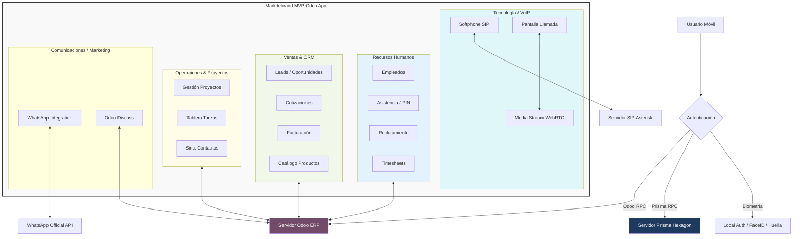

# Markdebrand_MVP_Odoo_v1.0

## A. Clasificación y Control (Niveles 1 y 2)

| Campo | Detalle |
| :--- | :--- |
| **Título del Módulo** | Mardebran MVP Odoo |
| **Versión** | V1.0 |
| **Categorización por Área** | Tecnología / Telecomunicaciones |
| **Versionamiento Estricto** | `Markdebrand_MVP_Odoo_v1.0` |
| **Estado** | Producción / MVP |

---

## B. Cuerpo de la Documentación (Nivel 3 - El "Qué")

### 1. Resumen de lo Realizado
Se ha desarrollado una aplicación móvil premium utilizando **Flutter** que integra de manera bidireccional los módulos críticos de **Odoo ERP** y una infraestructura de **Telefonía IP (VoIP)** con soporte para servidores externos mediante **Prisma RPC**.

### 2. Manual de Usuario y Módulos por Departamento

#### **Ventas / Marketing**
*   **CRM Dashboard**: Visualización de métricas de ventas y pipeline comercial.
*   **Gestión de Leads & Oportunidades**: Creación y seguimiento de prospectos desde el móvil.
*   **Mensajería Unificada**: Envío de mensajes vía **WhatsApp Integration** y **Odoo Discuss** para seguimiento de clientes.

#### **Recursos Humanos (RRHH)**
*   **Gestión de Empleados**: Directorio completo con búsqueda y perfiles detallados.
*   **Control de Asistencias**: Registro de entradas y salidas con validación de PIN.
*   **Reclutamiento**: Gestión de vacantes y candidatos en diversas etapas del pipeline.
*   **Timesheets**: Registro de horas trabajadas por proyecto/tarea.

#### **Operaciones**
*   **Gestión de Proyectos**: Visualización de proyectos activos y estados.
*   **Tablero de Tareas**: Edición y actualización de progreso en tiempo real.
*   **Contactos (Partners)**: Sincronización completa de la base de datos de socios.

#### **Finanzas**
*   **Cotizaciones (Quotes)**: Creación de presupuestos y envío directo al cliente.
*   **Facturación (Invoicing)**: Consulta de facturas pendientes y pagadas.
*   **Inventario / Productos**: Catálogo móvil con imágenes y precios actualizados.

#### **Tecnología / VoIP**
*   **Softphone Integrado**: Dialpad operativo con soporte para protocolo SIP.
*   **Pantalla de Llamada**: Interfaz visual con gestión de audio y WebRTC para llamadas de negocio.

### 2. Casos de Uso
*   **Venta en Terreno**: Un agente comercial recibe un Lead, realiza una llamada VoIP desde la app y actualiza la oportunidad inmediatamente en el CRM.
*   **Control de Planta**: Un empleado registra su asistencia mediante su PIN personal sin necesidad de hardware adicional.
*   **Reclutamiento Ágil**: Un reclutador revisa perfiles de candidatos y cambia su estado durante una entrevista.

### 3. SOP (Standard Operating Procedure)
*   **Configuración Inicial**:
    1. Ingresar URL del servidor Odoo y Base de Datos.
    2. Autenticación mediante credenciales Odoo o Biometría.
*   **Uso de VoIP**:
    1. Asegurar que el usuario tenga configurado `voip_username` y `voip_secret` en su perfil de Odoo.
    2. La aplicación se registrará automáticamente en el servidor SIP al iniciar sesión.

---

## C. Implementación Técnica (Nivel 4 - El "Cómo")

### 1. Diccionario de Datos (Modelos Base)
*   **res.users**:
    *   `voip_username`: Identificador SIP.
    *   `voip_secret`: Contraseña cifrada del servidor SIP.
    *   `voip_provider_id`: Referencia al proveedor de telefonía.
*   **res.partner**:
    *   `phone / mobile`: Números para marcación rápida.
    *   `image_1920`: Almacenamiento de fotos de perfil.
*   **crm.lead**:
    *   `stage_id`: Control de flujo comercial.
    *   `expected_revenue`: Valorización de oportunidades.

### 2. Gestión de Dependencias
*   `flutter_webrtc`: Motor de medios para la transmisión de audio.
*   `sip_ua`: Manejo de señalización SIP (REGISTRAR, INVITE, BYE).
*   `odoo_rpc`: Comunicación con el backend vía JSON-RPC.
*   `shared_preferences`: Persistencia local de configuración y sesión.

### 3. Arquitectura del Sistema (Diagrama)

---
*Documento generado para el proyecto Markdebrand MVP Odoo.*
*El diagrama técnico se encuentra en [Markdebrand_Architecture_XML.xml](Markdebrand_Architecture_XML.xml) (Compatible con Draw.io).*
